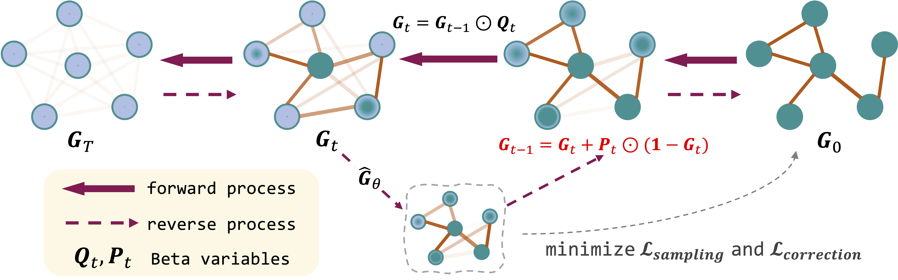
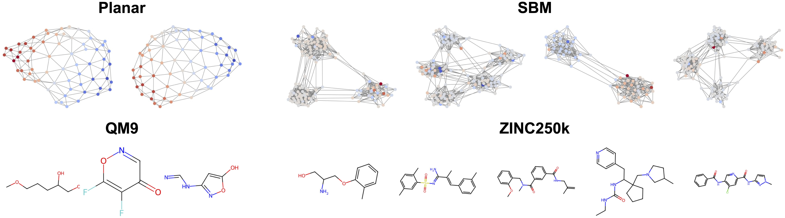
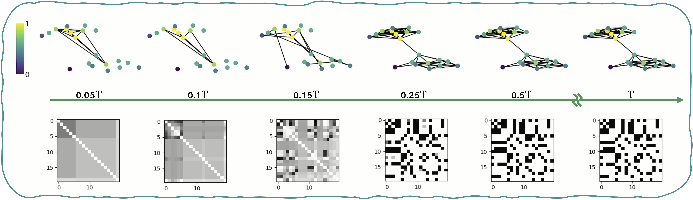

# [Advancing Graph Generation through Beta Diffusion](https://arxiv.org/abs/2406.09357) (ICLR 2025)

By [Xinyang Liu](https://xinyangatk.github.io)\*<sup>1</sup>, [Yilin He](https://scholar.google.com/citations?user=oJu3WzsAAAAJ&hl=en)\*<sup>1</sup>, [Bo Chen](https://web.xidian.edu.cn/bchen/)<sup>2</sup>, [Mingyuan Zhou](https://mingyuanzhou.github.io)<sup>1</sup>
\
<sup>1</sup>The University of Texas at Austin, <sup>2</sup>Xidian University
\
\*Equal contribution

<a href='https://arxiv.org/pdf/2406.09357'></a>




We introduce **GBD**, a **G**raph **B**eta **D**iffusion that specifically designed to handle the diverse nature of graph data, including both continuous and discrete graph elements. 
Additionally, we propose a modulation technique that enhances the realism of generated graphs by stabilizing critical graph topology while maintaining flexibility for other components. 
In doing so, GBD competes strongly with existing models across multiple general and biochemical graph benchmarks. 

In this repo, we will release (**updating**):

- Environment Dependencies &#x2705;
- Checkpoints &#x1F4CC;
- Reproducing Experiments &#x2705;
  - Dataset preparations 
  - Configurations 
  - Training 
  - Generation and Evaluation
- Visualization &#x1F4CC;


<a name="environment dependencies"></a>
## Environment Dependencies
Our code was built on [DiGress](https://arxiv.org/abs/2209.14734), please refer to the [Environment installation]((https://github.com/cvignac/DiGress?tab=readme-ov-file#environment-installation)) in **DiGress**.


<a name="reproducing experiments"></a>
## Reproducing Experiments

### 1. Dataset preparations

For `Community-small`, `Ego-small` and `Grid` datasets, please refer to [GDSS](https://github.com/harryjo97/GDSS).\
For `Planar`, `SBM`, `QM9` and `ZINC250k` datasets, please refer to [GruM](https://github.com/harryjo97/GruM/tree/master/GruM_2D#1-dataset-preparations).

### 2. Configurations
The configurations are provided in the ```config/``` directory in YAML format. Hyperparameters used in the experiments are specified in the Appendix E of our paper.

### 3. Training 
Training GBD on general and biochemical graph benchmark:
```
CUDA_VISIBLE_DEVICES=0,1,2,3 python main.py --type train --config <dataset> --seed 0
```

Training GBD with **Concentration Modulation** technique:

- Set ```concentration_m = True``` in experiment configs for traing GBD with concentration modulation technique!
- We provide specialized concentration modulation strategies for different datasets in ```modulation.py```. 

For the **new** dataset, custom concentration modulation strategy can be defined in a similar way with ```CustomConcentrationM``` module.


### 4. Generation and Evaluation

```
CUDA_VISIBLE_DEVICES=0,1,2,3 python main.py --type sample --config <dataset>
```

<a name="visualization"></a>
## Visualization


Edge generation process of with **concentration modulation defined by node degree** on  `Community-small` dataset.


<a name="acknowledgements"></a>
## Acknowledgements
This repository was heavily built off of [DiGress](https://github.com/cvignac/DiGress), [GDSS](https://github.com/harryjo97/GDSS) and [GruM](https://github.com/harryjo97/GruM/tree/master/GruM_2D).

<a name="citation"></a>
## Citation
```
@article{liu2024advancing,
  title={Advancing Graph Generation through Beta Diffusion},
  author={Liu, Xinyang and He, Yilin and Chen, Bo and Zhou, Mingyuan},
  journal={arXiv preprint arXiv:2406.09357},
  year={2024}
}
```


